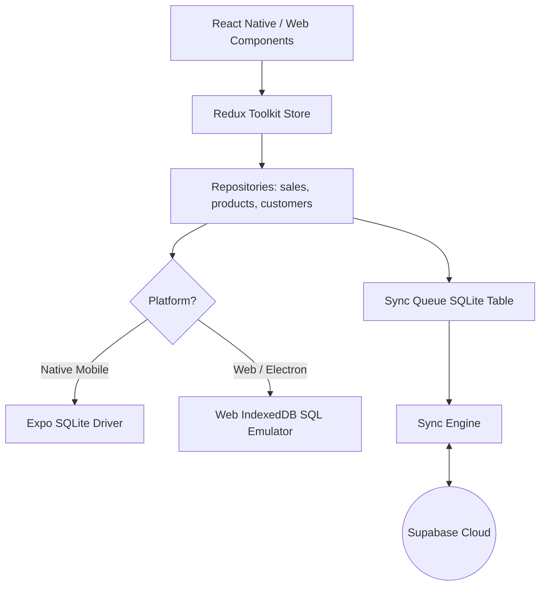

# Nairobi Mini Supermarket - Offline-First POS System

A high-performance, offline-first Point of Sale (POS) application built with React Native (Expo) and Electron. Designed for retail supermarkets, this application runs seamlessly on **Native Mobile (Android/iOS)**, **Web Browsers**, and **Desktop OS (Windows/macOS/Linux)**.

## Core Features

- **Offline-First Architecture**: Works completely offline. Saves transactions, product changes, customers, and inventory changes locally using SQLite (on native platforms) and IndexedDB (on Web/Electron).
- **Bidirectional Sync Engine**: Once an internet connection is detected, a custom outbound queue syncing service runs conflict-resolution and pushes local modifications to **Supabase**, while also pulling new cloud updates.
- **Cross-Platform**:
  - **Native Mobile**: Android & iOS apps via Expo.
  - **Desktop App**: Standalone Windows/macOS/Linux executables via Electron.
  - **Web**: Responsive layout supporting tablets and desktops.
- **Checkout & Cart Controls**: Add items, override prices (authorized shifts), apply item-level or global discounts, and hold transactions.
- **Multiple Payment Gateways**: Support for Cash, Card, Credit Accounts (Debtors ledger), and M-Pesa (with a simulated STK Push trigger).
- **Security & Shifts**: Locker terminal PIN lock (e.g. secure cashier shift takeovers) and role-based permissions (Cashier vs. Manager).
- **Hardware Integration**: Keyboard barcode scanner events handler and simulated camera scanner.
- **Reporting & Dashboard**: Real-time sales charts, best-selling product widgets, and inventory restock warnings.

---

## Technical Architecture

The application is structured around a modular offline-first layout:



### 1. Database Layer
- **Native (`src/database/driver.native.ts`)**: Integrates `expo-sqlite` to write raw SQL transactions to a local SQLite database (`pos_local.db`).
- **Web / Electron (`src/database/driver.ts`)**: Simulates a SQL execution engine on top of IndexedDB memory arrays (`pos_local_db`), enabling direct SQL compatibility (`SELECT`, `INSERT`, `UPDATE`, `DELETE`) inside web and desktop environments.

### 2. Synchronization Engine (`src/api/sync/syncEngine.ts`)
- **Outbound Sync**: Monitored changes are logged into a local `sync_queue` table. The sync engine processes these records sequentially. If a conflict occurs (server version > local version), a **Server Wins** resolution strategy is applied, pulling the remote copy down.
- **Inbound Sync**: Runs periodically (every 60 seconds) or when network connectivity is restored, querying Supabase for records updated since the last recorded sync.
- **Network Monitor**: Automatically intercepts NetInfo connection events to trigger sync catch-up routines.

---

## Project Structure

```
├── .expo/                 # Expo cache
├── assets/                # App icons, splash screens, and images
├── desktop/               # Electron main and preload entrypoints
├── src/
│   ├── api/               # Supabase client configuration & sync engine logic
│   ├── components/        # Reusable UI controls (Button, Card, Input)
│   ├── config/            # Color themes, gradients, and layout settings
│   ├── database/          # Database drivers, repositories, and SQLite schema
│   ├── features/          # Feature domains (auth, inventory, pos, dashboard, reports)
│   ├── hooks/             # Custom utility hooks (e.g. keyboard barcode scanner listener)
│   ├── services/          # External services (printing receipt, M-Pesa STK push)
│   ├── store/             # Redux Toolkit global store configuration
│   └── utils/             # Helper utilities (UUID generator, CSV export)
├── supabase/              # Cloud database schema configurations
├── App.tsx                # App startup entry point and router
├── tsconfig.json          # TypeScript compiler configuration
└── package.json           # Dependency management and scripts
```

---

## Setup & Running the Application

### Prerequisites
- Node.js (v18 or higher recommended)
- Git

### 1. Installation
Clone the repository and install the dependencies:
```bash
npm install
```

### 2. Configure Environment Variables
Create a `.env` file in the root folder (or copy from `.env.example`):
```bash
cp .env.example .env
```
Fill in your Supabase project credentials in the `.env` file:
```env
EXPO_PUBLIC_SUPABASE_URL=https://your-project-id.supabase.co
EXPO_PUBLIC_SUPABASE_ANON_KEY=your-anon-api-key
```

### 3. Run in Development
You can run the application on multiple platforms simultaneously:

- **Web Browser**:
  ```bash
  npm run web
  ```
- **Electron Desktop**:
  ```bash
  npm run dev:desktop
  ```
  *(This will start the local Expo web server and open a developer window in Electron loaded with the web port).*
- **Android / iOS (Expo Go)**:
  ```bash
  npm run android
  # or
  npm run ios
  ```

---

## Building for Production

### 1. Build Desktop App (Windows/macOS/Linux)
To export the web bundle and build native standalone desktop applications:
```bash
npm run build:desktop
```
This command compiles the React Native web export to the `dist` directory and triggers `electron-builder` to package standalone installers inside the `dist-desktop` folder.

---

## Troubleshooting

### TypeScript Compiler Stack Overflow
When running type-checking on Node.js (especially Node v24+), the extremely deep types of React Native combined with Redux Toolkit and other libraries may trigger a `RangeError: Maximum call stack size exceeded` in the TypeScript compiler.

To typecheck the project successfully, run the compiler with an increased stack size limit:
```bash
node --stack-size=65536 node_modules/typescript/bin/tsc --noEmit
```

## License
Licensed under the [MIT License](LICENSE).
